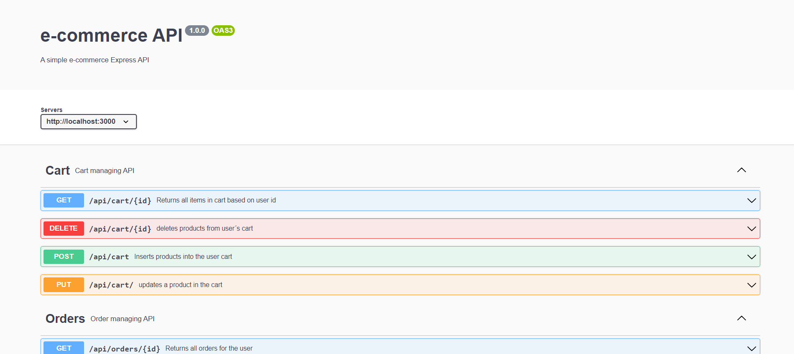

# e-commerce API

## Project description:

This is a very simple e-commerce API which was developed as part of the Codecademy's Full Stack Engineer career path.

For the server I´ve used Node.js/Express and the database is PostgreSQL.

One of the most important aspects of this project was the API documentation using Swagger and OpenAPI 3.0.

With it you can manage users, products, shopping cart and orders.
 - Users: Register, consult, modify and delete users
 - Login: user authentication using Passport.js
 - Products: Add, retrieve, modify information and delete products from the database
 - Cart: Add, delete or modify products in the user´s shopping cart
 - Orders: Retrieve order history for the users and create new order upon checkout

 You can access the API documentation on the route `/api/api-docs`

 

The next step in this project will be to develop the Front End for the e-commerce site.

## How to install the project localy:

In order to run this project locally you must have [Node](https://nodejs.org/en/download/) and [PostgreSQL](https://www.postgresql.org/download/) installed

1 Clone or download this repository from `https://github.com/gonzaleztucci/e-commerce-api`
2 Run `npm install` in order to get all required dependencies intalled
3 Run `npm start` in order to get the server running.
4 Add the database to your PostgreSQL by running the queries on the `\db\database.sql` file
5 Once you see the message `Example app listening at http://localhost:{yourSelectedPort}` you can start making requests to the API
6 Go to `http://localhost:3000/api-docs/` and you can send requests for all routes.

## License and Copyright

MIT License

Copyright (c) [2022] [Luis José Gonzalez]

Permission is hereby granted, free of charge, to any person obtaining a copy
of this software and associated documentation files (the "Software"), to deal
in the Software without restriction, including without limitation the rights
to use, copy, modify, merge, publish, distribute, sublicense, and/or sell
copies of the Software, and to permit persons to whom the Software is
furnished to do so, subject to the following conditions:

The above copyright notice and this permission notice shall be included in all
copies or substantial portions of the Software.

THE SOFTWARE IS PROVIDED "AS IS", WITHOUT WARRANTY OF ANY KIND, EXPRESS OR
IMPLIED, INCLUDING BUT NOT LIMITED TO THE WARRANTIES OF MERCHANTABILITY,
FITNESS FOR A PARTICULAR PURPOSE AND NONINFRINGEMENT. IN NO EVENT SHALL THE
AUTHORS OR COPYRIGHT HOLDERS BE LIABLE FOR ANY CLAIM, DAMAGES OR OTHER
LIABILITY, WHETHER IN AN ACTION OF CONTRACT, TORT OR OTHERWISE, ARISING FROM,
OUT OF OR IN CONNECTION WITH THE SOFTWARE OR THE USE OR OTHER DEALINGS IN THE
SOFTWARE.
